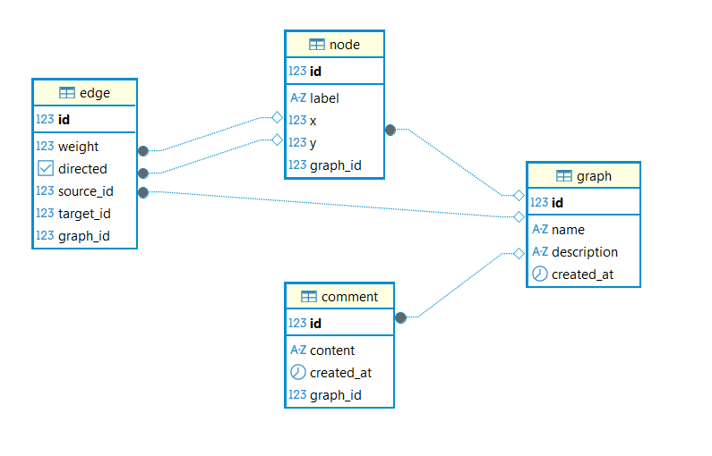

# graphapp

Graph visualization and algorithm playground built with JHipster (Spring Boot + React + PostgreSQL).

## Current state

- Backend: Spring Boot 3.4, Java 17, JPA/Hibernate, JWT security.
- Frontend: React 18 + TypeScript + D3 for graph rendering.
- DB: PostgreSQL with Liquibase migrations.
- Main user flows: create/edit graphs, visualize/run algorithms, (now) add/read comments on visualize page.

## Architecture

### High level

```text
React (src/main/webapp)
  -> Axios REST calls
Spring Boot REST API (src/main/java/com/graphapp/web/rest)
  -> Spring Data JPA repositories
PostgreSQL (Docker or local)
  <- schema managed by Liquibase changelogs
```

### Backend layout

Made via JHipster.

- `src/main/java/com/graphapp/domain`: JPA entities (`Graph`, `Node`, `Edge`, `Comment`, `User`...).
- `src/main/java/com/graphapp/repository`: Spring Data repositories.
- `src/main/java/com/graphapp/web/rest`: REST controllers.
- `src/main/java/com/graphapp/config`: security, CORS, app config.

### Frontend layout

- `src/main/webapp/app/modules/home/home.tsx`: graph list/discovery page.
- `src/main/webapp/app/entities/graph/graph-builder.tsx`: graph creation/editing UI.
- `src/main/webapp/app/modules/graph_player/graph_player.tsx`: visualize page and algorithm runner.
- `src/main/webapp/app/shared/graph`: rendering + algorithm implementations + API helpers.

## Data model



### Core entities

## API overview

Generated CRUD endpoints:

- `/api/graphs`
- `/api/nodes`
- `/api/edges`
- `/api/comments`

Custom aggregate endpoint:

- `GET /api/graphs/{id}/full` returns graph + all nodes + all edges in one DTO (`FullGraphDTO`).

Recent comments integration:

- `GET /api/comments?graphId={id}` returns comments scoped to one graph (new).
- `POST /api/comments` used by visualize page comment form.

## Security model

- API endpoints are authenticated by default (`/api/**`), except auth/register/reset endpoints.
- JWT resource-server configuration in `src/main/java/com/graphapp/config/SecurityConfiguration.java`.
- Frontend sends auth token through axios interceptor.

## Local runbook

Build src/main/docker/app.yml image then run this from project root:

```
./docker-up-all.ps1
```

To get access to the app, database, prometheus and grafana !

### DB credentials (Docker)

- Host: `localhost`
- Port: `5432`
- Database: `graphapp`
- User: `graphapp`
- Password: `admin`
